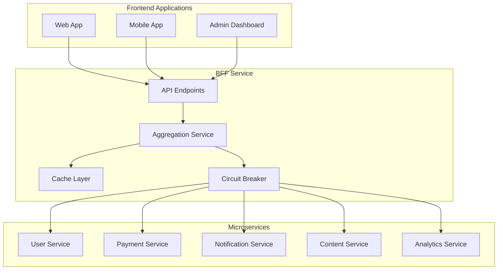

# Backend for Frontend (BFF) Pattern

## Overview

The Backend for Frontend (BFF) pattern is a microservices architecture pattern where a dedicated service is created for each frontend application or client type. In Cardinal, the BFF service acts as an aggregation layer between frontend applications and the microservices ecosystem.

## Why BFF?

### Problems BFF Solves

1. **Multiple API Calls**: Frontend needs to make multiple calls to different services
2. **Data Transformation**: Different data formats required by frontend
3. **Network Latency**: Multiple round trips increase response time
4. **Error Handling**: Complex error handling across multiple services
5. **Caching**: Difficult to cache data from multiple sources
6. **Service Coupling**: Frontend becomes tightly coupled to backend services

### BFF Benefits

1. **Single API**: Frontend makes one call instead of multiple
2. **Data Aggregation**: Combines data from multiple services
3. **Performance**: Reduces network round trips
4. **Caching**: Centralized caching strategy
5. **Error Handling**: Standardized error responses
6. **Frontend Optimization**: API designed for frontend needs

## Cardinal BFF Architecture



## BFF Service Components

### 1. API Layer
- **RESTful Endpoints**: Clean, frontend-optimized API
- **Authentication**: JWT token validation
- **Request Validation**: Input validation and sanitization
- **Response Formatting**: Standardized response format

### 2. Aggregation Service
- **Data Combination**: Merges data from multiple services
- **Business Logic**: Frontend-specific business rules
- **Data Transformation**: Converts backend data to frontend format
- **Error Aggregation**: Combines errors from multiple services

### 3. Cache Layer
- **Response Caching**: Caches aggregated responses
- **TTL Management**: Time-to-live for cached data
- **Cache Invalidation**: Smart cache invalidation
- **Performance**: Reduces backend load

### 4. Circuit Breaker
- **Fault Tolerance**: Handles service failures gracefully
- **Fallback Responses**: Provides fallback data when services are down
- **Service Health**: Monitors service health
- **Automatic Recovery**: Recovers when services come back online

## API Design Patterns

### 1. Aggregation Endpoints

```typescript
// Instead of multiple calls:
// GET /users/profile
// GET /payments/recent
// GET /notifications/unread

// Single aggregated call:
GET /api/v1/dashboard
```

**Response:**
```json
{
  "success": true,
  "data": {
    "user": { "id": "1", "name": "John Doe" },
    "recentPayments": [...],
    "notifications": [...],
    "stats": { "totalPayments": 10, "unreadNotifications": 3 }
  },
  "timestamp": "2023-01-01T00:00:00.000Z"
}
```

### 2. Pagination Aggregation

```typescript
// Combines pagination from multiple services
GET /api/v1/dashboard?page=1&limit=10
```

### 3. Error Aggregation

```typescript
// Combines errors from multiple services
{
  "success": false,
  "error": "AGGREGATION_ERROR",
  "message": "Some services are unavailable",
  "errors": [
    { "service": "payment-service", "error": "Service unavailable" },
    { "service": "notification-service", "error": "Timeout" }
  ]
}
```

## Implementation Details

### 1. Service Communication

```typescript
@Injectable()
export class AggregationService {
  async getDashboardData(userId: string): Promise<DashboardData> {
    // Parallel service calls
    const [user, payments, notifications] = await Promise.allSettled([
      this.userService.getProfile(userId),
      this.paymentService.getRecentPayments(userId),
      this.notificationService.getUnreadNotifications(userId)
    ]);

    // Aggregate results
    return this.aggregateDashboardData(user, payments, notifications);
  }
}
```

### 2. Caching Strategy

```typescript
@Cache('dashboard', 300) // 5 minutes
async getDashboardData(userId: string): Promise<DashboardData> {
  // Implementation
}
```

### 3. Circuit Breaker Implementation

```typescript
@CircuitBreaker({
  failureThreshold: 5,
  timeout: 5000,
  resetTimeout: 60000
})
async callUserService(endpoint: string): Promise<any> {
  // Implementation
}
```

## Data Flow

### 1. Request Processing

```
1. Frontend sends request to BFF
2. BFF validates authentication
3. BFF calls multiple microservices in parallel
4. BFF aggregates responses
5. BFF applies caching if applicable
6. BFF returns aggregated response
```

### 2. Error Handling

```
1. Service call fails
2. Circuit breaker detects failure
3. Fallback data returned if available
4. Error logged and monitored
5. Graceful degradation to frontend
```

### 3. Caching Flow

```
1. Check cache for existing data
2. If cache hit, return cached data
3. If cache miss, call services
4. Store result in cache
5. Return data to frontend
```

## Performance Optimizations

### 1. Parallel Service Calls

```typescript
// Instead of sequential calls
const user = await this.userService.getProfile(userId);
const payments = await this.paymentService.getPayments(userId);

// Use parallel calls
const [user, payments] = await Promise.all([
  this.userService.getProfile(userId),
  this.paymentService.getPayments(userId)
]);
```

### 2. Intelligent Caching

```typescript
// Cache frequently accessed data
@Cache('user-profile', 1800) // 30 minutes
async getUserProfile(userId: string) {
  // Implementation
}

// Cache with dynamic keys
@Cache('user-payments-${userId}', 300) // 5 minutes
async getUserPayments(userId: string) {
  // Implementation
}
```

### 3. Response Compression

```typescript
// Compress large responses
app.use(compression());
```

## Error Handling Strategies

### 1. Graceful Degradation

```typescript
async getDashboardData(userId: string): Promise<DashboardData> {
  const results = await Promise.allSettled([
    this.userService.getProfile(userId),
    this.paymentService.getPayments(userId),
    this.notificationService.getNotifications(userId)
  ]);

  // Handle partial failures gracefully
  return {
    user: results[0].status === 'fulfilled' ? results[0].value : null,
    payments: results[1].status === 'fulfilled' ? results[1].value : [],
    notifications: results[2].status === 'fulfilled' ? results[2].value : []
  };
}
```

### 2. Circuit Breaker Pattern

```typescript
// Open circuit when service fails
if (failureCount >= threshold) {
  circuitState = 'OPEN';
  // Return cached data or error
}
```

### 3. Retry Logic

```typescript
// Retry failed requests
async callWithRetry(serviceCall: () => Promise<any>, maxRetries = 3) {
  for (let i = 0; i < maxRetries; i++) {
    try {
      return await serviceCall();
    } catch (error) {
      if (i === maxRetries - 1) throw error;
      await this.delay(1000 * Math.pow(2, i)); // Exponential backoff
    }
  }
}
```

## Monitoring and Observability

### 1. Metrics

- **Response Time**: Track aggregated response times
- **Cache Hit Rate**: Monitor cache effectiveness
- **Circuit Breaker Status**: Track service health
- **Error Rates**: Monitor service failures

### 2. Logging

```typescript
// Structured logging
this.logger.log('Dashboard data aggregated', {
  userId,
  duration: Date.now() - startTime,
  services: ['user', 'payment', 'notification'],
  cacheHit: true
});
```

### 3. Health Checks

```typescript
@Get('health')
async getHealth() {
  const services = await this.checkServiceHealth();
  return {
    status: 'healthy',
    services,
    timestamp: new Date().toISOString()
  };
}
```

## Best Practices

### 1. API Design
- Keep endpoints frontend-focused
- Use consistent response formats
- Implement proper HTTP status codes
- Version your APIs

### 2. Caching
- Cache at the right level
- Use appropriate TTL values
- Implement cache invalidation
- Monitor cache performance

### 3. Error Handling
- Provide meaningful error messages
- Implement graceful degradation
- Log errors for debugging
- Monitor error rates

### 4. Performance
- Use parallel service calls
- Implement proper caching
- Optimize data aggregation
- Monitor response times

## Anti-Patterns to Avoid

### 1. Over-Aggregation
- Don't aggregate everything into one endpoint
- Keep aggregation focused and purposeful
- Consider data freshness requirements

### 2. Tight Coupling
- Don't make BFF too specific to one frontend
- Keep business logic in appropriate services
- Avoid duplicating service logic

### 3. Poor Error Handling
- Don't fail completely on partial errors
- Provide meaningful error messages
- Implement proper fallback strategies

### 4. Inefficient Caching
- Don't cache everything
- Use appropriate cache keys
- Implement proper cache invalidation
