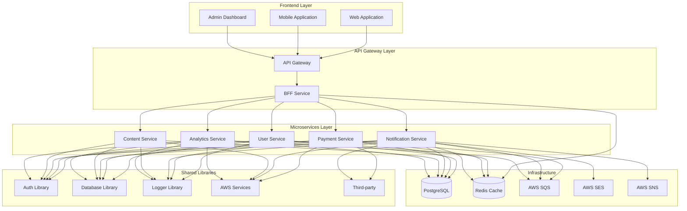

# System Architecture

## Overview

Cardinal is a microservices platform built with NestJS and designed for AWS Lambda deployment. It follows modern architectural patterns including microservices, Backend for Frontend (BFF), and event-driven architecture.

## High-Level Architecture



## Core Components

### 1. Frontend Layer
- **Web Applications**: React, Vue, or Angular applications
- **Mobile Applications**: React Native or native mobile apps
- **Admin Dashboards**: Administrative interfaces

### 2. API Gateway Layer
- **API Gateway**: AWS API Gateway for routing and authentication
- **BFF Service**: Backend for Frontend aggregation service

### 3. Microservices Layer
- **User Service**: User management and authentication
- **Payment Service**: Payment processing and billing
- **Notification Service**: Email, SMS, and push notifications
- **Content Service**: Content management and delivery
- **Analytics Service**: Data analytics and reporting

### 4. Shared Libraries
- **Auth Library**: Authentication and authorization
- **Database Library**: Database abstraction and utilities
- **Logger Library**: Centralized logging
- **AWS Services**: AWS service integrations
- **Third-party**: External service integrations

### 5. Infrastructure
- **Database**: PostgreSQL for data persistence
- **Cache**: Redis for caching and session storage
- **Message Queue**: AWS SQS for async processing
- **Email Service**: AWS SES for email delivery
- **Notification Service**: AWS SNS for push notifications

## Design Principles

### 1. Microservices Architecture
- **Single Responsibility**: Each service has one business capability
- **Independent Deployment**: Services can be deployed independently
- **Technology Diversity**: Services can use different technologies
- **Fault Isolation**: Failure in one service doesn't affect others

### 2. Backend for Frontend (BFF)
- **Frontend Optimization**: API designed for frontend needs
- **Data Aggregation**: Combines multiple service calls
- **Caching**: Reduces backend load
- **Error Handling**: Standardized error responses

### 3. Event-Driven Architecture
- **Asynchronous Processing**: Non-blocking operations
- **Loose Coupling**: Services communicate via events
- **Scalability**: Easy to scale individual components
- **Resilience**: Better fault tolerance

### 4. Cloud-Native Design
- **Serverless**: AWS Lambda for compute
- **Managed Services**: Use AWS managed services
- **Auto-scaling**: Automatic scaling based on demand
- **Pay-per-use**: Cost-effective resource utilization

## Data Flow

### 1. Request Flow
```
Frontend → API Gateway → BFF Service → Microservice → Database
```

### 2. Response Flow
```
Database → Microservice → BFF Service → API Gateway → Frontend
```

### 3. Event Flow
```
Service A → SQS → Service B → Database
```

## Security Architecture

### 1. Authentication
- JWT tokens for stateless authentication
- Role-based access control (RBAC)
- Multi-factor authentication support

### 2. Authorization
- Service-level authorization
- Resource-level permissions
- API endpoint protection

### 3. Data Protection
- Encryption at rest using AWS KMS
- TLS/SSL for data in transit
- Secure environment variable management

## Scalability Considerations

### 1. Horizontal Scaling
- Microservices can scale independently
- Load balancing across multiple instances
- Auto-scaling based on metrics

### 2. Vertical Scaling
- Increase memory and CPU for services
- Database scaling strategies
- Cache optimization

### 3. Performance Optimization
- Caching at multiple levels
- Database query optimization
- CDN for static content

## Monitoring and Observability

### 1. Logging
- Centralized logging with structured logs
- Log aggregation and analysis
- Real-time log monitoring

### 2. Metrics
- Application performance metrics
- Infrastructure metrics
- Business metrics

### 3. Tracing
- Distributed tracing across services
- Request flow visualization
- Performance bottleneck identification

## Deployment Architecture

### 1. Development Environment
- Local development with Docker
- Hot reloading for rapid development
- Local database and services

### 2. Staging Environment
- Production-like environment
- Integration testing
- Performance testing

### 3. Production Environment
- AWS Lambda deployment
- High availability setup
- Disaster recovery planning

## Technology Stack

### Backend
- **Framework**: NestJS
- **Language**: TypeScript
- **Runtime**: Node.js 18+
- **Database**: PostgreSQL
- **Cache**: Redis

### Cloud Services
- **Compute**: AWS Lambda
- **Database**: AWS RDS
- **Cache**: AWS ElastiCache
- **Storage**: AWS S3
- **Messaging**: AWS SQS, SNS
- **Email**: AWS SES

### Frontend
- **Web**: React, Vue, or Angular
- **Mobile**: React Native or native
- **State Management**: Redux, Vuex, or NgRx

## Future Considerations

### 1. Multi-Region Deployment
- Global availability
- Data replication
- Disaster recovery

### 2. Advanced Caching
- CDN integration
- Edge caching
- Smart cache invalidation

### 3. Machine Learning
- Predictive analytics
- Automated scaling
- Intelligent routing

### 4. GraphQL Support
- Unified API layer
- Real-time subscriptions
- Advanced querying capabilities
